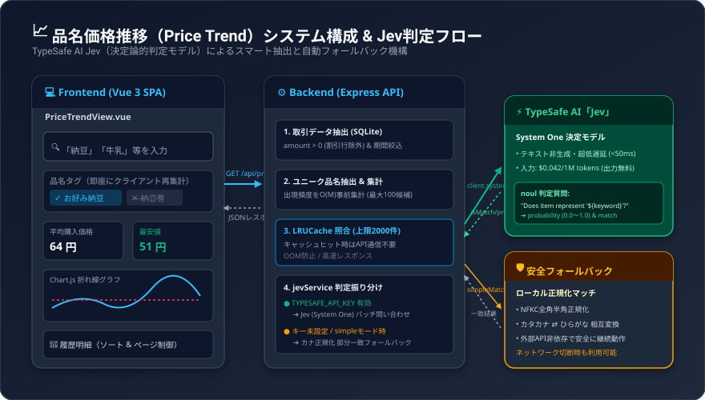

# 品名価格推移分析機能（TypeSafe AI「Jev」連携）技術解説

家計簿アプリ Gravity に新設された **「価格推移（Price Trend）」** ビューの設計、TypeSafe AI の決定論的判定モデル「Jev」の活用、および堅牢なハイブリッドアーキテクチャについての解説ドキュメントです。

---

## 1. 概要と背景

### 課題: 家計簿データにおける品名の「表記揺れ」

レシートOCRや手入力によって蓄積された取引データでは、同一の商品であっても店舗や規格によって品名表記が様々に異なります。

- **例: 「納豆」の購入履歴**
  - `お好み納豆極小粒`（パック納豆）
  - `お好みな納豆極小粒`（誤読・表記揺れ）
  - `お好み納豆小粒`（パック納豆）
  - `納豆細巻` / `納豆巻ハーフ7本`（お寿司・惣菜）

従来の単純な部分一致（`LIKE '%納豆%'`）では、目的のパック納豆の価格推移を見たい場合に「納豆巻き」などの別商品が混入し、平均価格やグラフが歪んでしまう課題がありました。

### 解決策: 決定論的判定モデル「Jev」の導入

TypeSafe AI が提供する決定論的判定モデル **「Jev」** を採用し、入力されたキーワード（例:「納豆」）に対して、各品名がその商品カテゴリに該当するかを超高速・低コストに判定する仕組みを構築しました。

---

## 2. システム構成 &amp; 判定フロー

以下はフロントエンド、バックエンド、Jev API、およびフォールバック機構の全体像です。



### 処理フロー（Mermaid）

```mermaid
flowchart TD
    User([ユーザー]) -->|1. キーワード入力「納豆」| UI[PriceTrendView.vue]
    UI -->|2. GET /api/price_trend?keyword=納豆| API[Express API: price_trend.js]

    subgraph Backend [バックエンド集計 & 判定]
        API -->|3. 支出データ抽出 (amount > 0)| DB[(SQLite: transactions)]
        DB -->|取引明細| API
        API -->|4. 取引行を走査しユニーク品名を抽出| Agg[品名候補一覧 (最大100件)]

        Agg -->|5. キャッシュ確認| Cache{LRUCache<br/>上限2000件}
        Cache -->|ヒット| Matched[判定結果一覧]

        Cache -->|未キャッシュ| ModeCheck{モード & キー確認<br/>TYPESAFE_API_KEY?}

        ModeCheck -->|有効 (Jev)| JevCall[TypeSafe AI Jev API<br/>client.systemOne<br/>5秒タイムアウト]
        ModeCheck -->|未設定 / simpleモード| Fallback[正規化フォールバック<br/>全角半角/カナ変換/部分一致]

        JevCall -->|判定成功 (isMatch & prob)| Cache
        JevCall -.->|一時エラー/タイムアウト| Fallback

        Fallback -->|未設定時の結果| Cache
        Fallback -.->|一時エラー時の結果 (キャッシュ非保存)| Matched
        Cache --> Matched
    end

    Matched -->|6. サマリー計算 & 取引データ返却| API
    API -->|7. JSONレスポンス| UI

    subgraph Frontend [画面表示 & クライアント動的再集計]
        UI --> Tags[品名タグ: クリックで除外/再追加]
        Tags -.->|クライアント側で即時再計算| Dynamic[動的サマリー & フィルタ]
        Dynamic --> Cards[統計カード: 平均/最安/最高/前回比]
        Dynamic --> Chart[Chart.js 折れ線グラフ]
        Dynamic --> Table[明細テーブル: ページネーション & ソート]
    end
```

---

## 3. なぜ TypeSafe AI「Jev」なのか？

### 「System One（直感・即座の決定）」モデルの優位性

従来の生成AI（Gemini や GPT などの System Two モデル）は、高度な推論やテキスト生成を行う反面、以下の課題がありました。

1. **レイテンシ**: プロンプト解釈と文章生成のオーバーヘッドにより、数秒以上の待ち時間が発生します。
2. **コスト**: トークン消費が大きく、検索のたびに数百件の品名を問い合わせると課金が膨らみます。
3. **不安定性**: JSONフォーマットの崩れや予期せぬ自然言語が混入するリスクを伴います。

これに対し、**Jev** はソフトウェア内の意思決定や型安全な判定に特化したモデルです。

- **超低遅延**: 数十ミリ秒オーダー（<50ms）で判定結果を出力します。
- **低コスト**: 入力 `$0.042 / 1M tokens`（出力トークン無料）であり、従来のLLM比で数百倍安価です。
- **型安全な `noul` 判定**: Yes/No の二値判定と確率（`0.0` 〜 `1.0`）を直接取得できます。

```javascript
// Jev 呼び出しの実装例（server/lib/jevService.js）
const response = await client.systemOne({
  state: {
    item_name: safeItemName,
    target_keyword: safeKeyword,
  },
  questions: {
    is_match: noul(
      `Does the grocery or purchase item named "${safeItemName}" represent, contain, or belong to "${safeKeyword}"?`
    ),
  },
})

const probability = response?.answers?.is_match?.noul ?? 0
const isMatch = probability >= 0.5 // 確率50%以上で該当と判定
```

---

## 4. 堅牢化とパフォーマンス最適化

本機能の実装にあたっては、批判的コードレビューを経て以下の安全設計と最適化を行っています。

### ① インメモリ LRU キャッシュ（メモリリーク防止）

無制限の `Map` を用いると長期稼働時に OOM（メモリ枯渇）を引き起こす恐れがあるため、最大 2,000 件上限の `LRUCache` クラスを実装しています。

- 上限を超えた場合は最も古いエントリから自動破棄されます。
- 同一キーワードでの再検索時は外部 API への通信が発生せず、インメモリから即座に判定結果を取得します。

### ② DoS / API過負荷防止

家計簿内に数千種類の品名が存在する場合でも、外部 API への過剰なリクエストを防ぐよう以下の制御を行っています。

- キーワード部分一致や出現頻度上位から、判定対象を最大 100 件のユニーク品名に制限しています。
- Jev API への問い合わせを同時実行数 10 件ずつのバッチに分割して実行します。
- 取引データの走査時に品名の出現頻度を `O(M)`（M = 取引件数）で事前集計し、無駄なループ処理を排除しています。

### ③ 安全な自動フォールバック機構

`TYPESAFE_API_KEY` が未設定の環境や、ネットワーク切断・一時的な API エラーが発生した場合でも、アプリケーションは安全に動作を継続します。

- NFKC による全角半角正規化、英字小文字化を実施します。
- カタカナ ⇄ ひらがな相互変換による柔軟な部分一致に対応しています（例: 「オカメナットウ」と「なっとう」の一致）。
- 一時的なエラー（HTTP 429 やタイムアウトなど）によるフォールバック結果は、キャッシュ汚染を防ぐため LRU キャッシュへ永続化しません。

### ④ 割引明細（マイナス金額）の除外

家計簿アプリの仕様上、クーポンや値引き明細は有効な支出行としてマイナス金額（例: `-50円`）で保存されます。価格推移の分析においてこれらが「最安値: -50円」と誤認されるのを防ぐため、`amount > 0` の正数明細のみを集計対象としています。

### ⑤ フロントエンド描画負荷の軽減とクライアント側即時再集計

- **クライアント側リアクティブ再集計**: 品名タグ（微調整チップ）の除外・復元操作時はサーバーへ再リクエストを行わず、フロントエンドの算出プロパティ（`computed`）で即座に統計・グラフを再計算します。
- **ページネーション**: 明細テーブルは1ページあたり20件の表示制御を行い、大量データ時もブラウザの描画負荷を抑制します。
- **アクセシビリティ（a11y）**: ソート列の `aria-sort` やキーボード操作（Enter/Space）、品名タグの `role="checkbox"` と `aria-checked` に対応しています。

---

## 5. 設定と利用手順

### 環境変数の設定（任意）

本機能は API キー未設定でもフォールバックモード（部分一致）で即座に利用可能です。
Jev によるスマート判定を有効化する場合は、`server/.env` にキーを設定してサーバーを再起動します。

```env
# TypeSafe AI API キー（Jevによる品名判定で使用）
TYPESAFE_API_KEY=your_typesafe_api_key_here
```

### 画面での操作

1. 上部ナビゲーションから **「価格推移」** を開きます。
2. 調べたい品名（例:「納豆」「牛乳」「卵」「ビール」など）を入力、またはクイック検索ボタンをクリックします。
3. 画面右上のセレクターから、判定モード（`⚡ Jev判定` / `部分一致`）や集計期間（`全期間` / `3年` / `1年`）を切り替えることができます。
4. 抽出された品名タグ一覧（例: `お好み納豆極小粒`, `納豆細巻`）から、不要な商品をクリックしてOFFにすることで、グラフや平均価格をリアルタイムに微調整できます。
